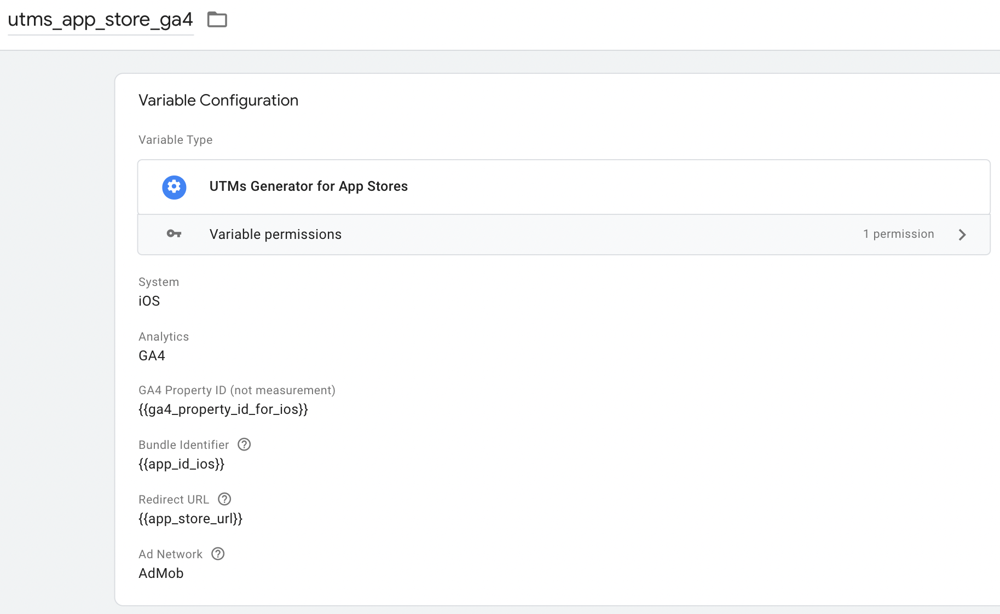

This is template to generate URLs with associated UTMs that works for attribution on both Play Store and App Store.

It's all based on the solution given by Google here: https://ga-dev-tools.web.app/ga4/campaign-url-builder/play/ but within a GTM environment. This allow us to generate dynamic URLs based on the user campaign attribution when arrives to our website.

For this to work properly it needs also the Campaign Data on Cookie Template installed on GTM: https://github.com/74minutos/campaign_data_on_cookie

For a long explanation of how this works, check this article (in spanish): https://visiondefunnel.com/2022/05/01/utms-y-gtm-i-campanas-en-app-y-play-store/

Configuration example:

